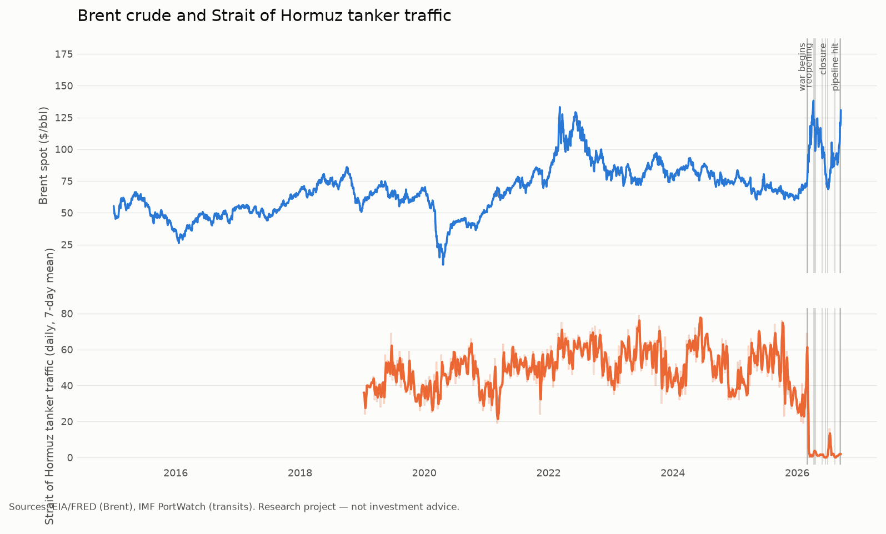

# Tanker Tape

**Brent crude × AIS shipping signals.**

Measures how physical oil flows observed in AIS ship-tracking data relate to Brent crude
prices, and tests whether AIS-derived signals carry *incremental, out-of-sample*
information about Brent returns and volatility.

> **This is a research and portfolio project, not a trading system.** Nothing here is
> investment advice. Correlation measured around a geopolitical shock is not a tradable
> edge — see [Limitations](#limitations), which is the most important section of this file.

<picture>
  <source media="(prefers-color-scheme: dark)" srcset="docs/figures/brent-vs-transits-dark.png">
  
</picture>

*Regenerated automatically from each weekly data pull ([workflow](.github/workflows/weekly-data.yml)).
Every series shown is pulled from EIA/FRED and IMF PortWatch — nothing here is simulated.
The figure appears once the first scheduled pull has run.*

Note the two panels rather than two y-axes. Overlaying price and transit counts on a
shared plot with independent scales would manufacture an apparent amplitude relationship
out of where the scales happened to be pinned; stacked panels keep the only honest
comparison, which is timing.

---

## Why this question is interesting right now

The 2026 Strait of Hormuz crisis is an unusually clean natural experiment: a physical
supply shock, visible in ship movements, hitting a liquid futures market. The dated events
driving it live in [`data/reference/events.csv`](data/reference/events.csv), each with a
source URL and a confidence rating.

The honest prior is that this will *mostly not work* for daily price direction. Public
information is priced quickly, and PortWatch's weekly publication schedule means the
headline AIS data arrives days late. The interesting places to look are volatility, the
Brent–WTI spread, and regime shifts — and the pipeline is built to report a null result as
readily as a positive one.

## Status

Pipeline complete and wired end to end; **no data has been collected yet**. Every module is
implemented and unit-tested, and the first scheduled run (2026-09-16) confirmed the
PortWatch endpoints work — the chokepoints layer pulled cleanly in 13 seconds. That run also
showed the ports layer is over 1.6 million rows, so it is now filtered server-side to the
terminals in `config/ports.yaml`. See the endpoint verification log in
[`CLAUDE.md`](CLAUDE.md) for what is confirmed live and what is still assumed.

Start here:

```bash
uv sync --all-extras
cp .env.example .env          # add your EIA / aisstream keys
uv run tanker-tape verify-endpoints   # confirms live URLs and schemas
uv run tanker-tape validate-gates     # geometry check, no network needed
```

`verify-endpoints` exists because the URLs in the source brief were gathered from research
rather than observed. It prints what each endpoint actually returns, including the live
field names, so the schema-tolerant parsers can be pointed at real columns.

## Quickstart

```bash
# 1. Start collecting live AIS immediately - there is no historical backfill for it.
uv run tanker-tape collect-ais            # run under systemd/cron, 24/7

# 2. Historical backbone
uv run tanker-tape ingest-prices --start 2015-01-01
uv run tanker-tape ingest-portwatch --dataset chokepoints

# 3. Turn collected AIS into daily metrics (once the collector has data)
uv run tanker-tape build-ais-metrics

# 4. Build the modelling table, then look at it
uv run tanker-tape build-features
uv run tanker-tape charts          # figures -> docs/figures (light + dark)
uv run tanker-tape report          # writes reports/research-report-<date>.md
uv run tanker-tape dashboard
```

`tanker-tape status` shows what is configured and what is on disk.

## Data sources

| Source | What it gives | Key | Notes |
|---|---|---|---|
| EIA API v2 | Brent (`RBRTE`) and WTI (`RWTC`) daily spot | Free | Series of record. Publishes with a lag. |
| FRED | `DCOILBRENTEU`, `DCOILWTICO` | None | Same underlying EIA data; unauthenticated CSV fallback. |
| yfinance | `BZ=F`, `CL=F` futures closes | None | **Unofficial.** Timely closes and sanity checks only; never the series of record. |
| IMF PortWatch | Daily transit calls and trade volumes for 28 chokepoints and ~2,065 ports | None | The historical backbone. Weekly, Tuesdays 09:00 ET, and **revised**. |
| aisstream.io | Live raw AIS positions and static data | Free | Our own collection. No history — every uncollected day is lost. |

Paid upgrades (Kpler, Vortexa, Spire, MarineTraffic, Signal Ocean) are deliberately *not*
built against, but the ingestion layer is organised so one could be slotted in. Ask before
adding any paid source.

## Architecture

```
src/tanker_tape/
├── config.py            pydantic-settings; zones/gates/ports from config/*.yaml
├── storage.py           Parquet + DuckDB, vintage-aware (as-of) reads
├── ingest/
│   ├── prices.py        EIA v2, FRED, yfinance
│   ├── portwatch.py     paginated ArcGIS FeatureServer pulls, stores vintages
│   └── aisstream.py     async websocket collector, hourly Parquet
├── process/
│   ├── transits.py      gate-line crossing detection
│   ├── vessel_state.py  laden/ballast, waiting fleet, dark gaps, quality flags
│   ├── ais_metrics.py   raw collected AIS -> daily per-zone metrics
│   └── features.py      daily feature table (leakage rules live here)
├── analysis/
│   ├── event_study.py   abnormal returns around dated events
│   ├── causality.py     stationarity, VAR, Granger both ways, local projections
│   ├── forecast.py      walk-forward, benchmarks, Diebold-Mariano
│   ├── charts.py        figures for the report, README and dashboard
│   └── report.py        generates the research report
└── dashboard/app.py     Streamlit
```

Scheduling lives in `deploy/` (a hardened systemd unit for the collector, plus a
deployment guide) and `.github/workflows/` (CI on every push, and a weekly
Wednesday data pull timed to land after PortWatch's Tuesday release).

Business logic lives in `src/`. Notebooks are for exploration only.

### Core logic

**Transit detection.** Each chokepoint is a gate LineString plus a zone Polygon. A transit
is two consecutive fixes for one vessel on opposite sides of the gate within 6 hours.
Crossings bracketed by a longer gap are flagged `ambiguous` and reported separately rather
than counted or dropped. Vessels are keyed on IMO where known, so a mid-voyage MMSI change
does not split one ship into two, and repeat crossings within 6 hours are collapsed so a
vessel loitering on the gate does not read as a fleet.

**Laden/ballast.** `laden_ratio = reported_draught / max_draught for that vessel`, using the
vessel's own observed maximum where available and a class-typical value by length
otherwise. Laden above 0.75 (calibrate this). `max_draught_source` and `draught_age_hours`
travel with every row because the input is hand-entered and frequently stale.

**Waiting fleet.** Tankers inside a zone below 1 knot for over 6 hours, split into anchored
and drifting by navigational status. Probably the most informative live metric during a
closure: ships that cannot transit pile up rather than disappear.

**Data quality.** Implied speeds over 40 knots, positions shared by many MMSIs at one
timestamp (the GPS-jamming signature), and AIS silences over 12 hours inside a zone. Every
one of these is flagged and counted, never silently dropped.

### Three feature families, treated differently

The feature table joins three kinds of input, and the difference between them is a
correctness question rather than a stylistic one:

| Source | Lag | Carried forward? |
|---|---|---|
| PortWatch chokepoints and ports | publication date (weekly, Tuesdays) | yes, with `*_age_days` |
| Cross-route shares (Cape vs Suez) | inherits the PortWatch lag | yes |
| Our own AIS metrics (`ais_*`) | none — readable the same day | **no** |

Carrying a PortWatch value forward asserts "last week's published figure is still the
latest one," which is true. Carrying our own AIS forward would assert "yesterday's
traffic also happened today," which is false — a gap there means the collector was
down, and filling it would invent observations. So `ais_*` columns stay sparse, and
`ais_quality_daily.hours_with_data` is how you tell a quiet day from a missed one.

Columns are prefixed by source (`hormuz_n_transits` from PortWatch,
`ais_hormuz_n_transits` from our own collection) so the two never silently merge.

## The leakage rules

Getting a positive result here is easy if the code cheats. These constraints are
implemented in `process/features.py` and `analysis/forecast.py`, and enforced by
`tests/test_no_lookahead.py`:

- **Backward-only baselines.** Rolling z-scores use `shift(1)`, so date *t* is excluded from
  its own mean and standard deviation, and later dates are excluded entirely.
- **Publication lag.** PortWatch publishes weekly on Tuesdays, so Friday's transit count is
  not a Friday feature. Features join on `available_from`, never on `date`.
- **As-of vintages.** Every PortWatch pull is stored immutably under a `retrieved_at`
  partition. Asking for a vintage older than any on disk raises rather than backfilling.
- **No full-sample scaling.** Scalers live inside a per-fold Pipeline.
- **Horizon-length embargo.** Predicting date *i* at horizon *h* trains only on rows up to
  *i − h*, because a 20-day target at *t* is not observable until *t + 20*.
- **Naming discipline.** `ret_*` and `rv_*` are backward-looking and legal as features;
  `fwd_ret_*` are targets. `walk_forward` raises if a `fwd_` column is passed as a feature.

The no-lookahead test works by perturbing *future* values and asserting nothing at or
before the perturbation moves — and it includes a test that a deliberately leaky
implementation would fail, so the guard itself is guarded.

## Analysis plan

1. Descriptives and sanity checks; compare our AIS counts against PortWatch on overlapping days.
2. Stationarity (ADF + KPSS); model changes and z-scores, never raw levels.
3. Event study: abnormal returns in a −5/+20 day window, pre-war and war regimes separately.
4. VAR with lag selection, Granger causality **in both directions**, Jordà local projections.
5. Rolling 60/120-day correlations and betas to expose regime dependence.
6. Walk-forward forecasting at 1/5/20 days against a benchmark ladder: zero forecast →
   training mean → price-only features → price + AIS. Diebold-Mariano on the last step.
7. Toy backtest **only if step 6 is significant**, with costs and slippage, clearly labelled
   hypothetical.

On step 4: prior work finds oil prices drive tanker routing as much as the reverse, so
`granger_both_directions` always returns both and warns when both are significant. That
pattern is feedback, not evidence that AIS leads prices.

## Development

```bash
uv run pytest              # unit tests
uv run ruff check .        # lint
uv run ruff format .       # format
uv run mypy src            # types
```

Tests cover gate crossing and direction, MMSI/IMO deduplication, laden classification,
baseline z-scores, vintage as-of resolution, aisstream parsing, report generation, and the
no-lookahead guarantee.

The report generator guards each section independently: if the event study fails, the
report says so in place and still produces the forecasting results. A partial report that
names what broke beats a traceback and no report.

## Limitations

Read this section before believing any number this project produces.

**AIS spoofing and the dark fleet.** IMF PortWatch explicitly warns of GPS jamming, AIS
spoofing, and vessels going dark around Hormuz — and those behaviours increase exactly when
the situation gets interesting, so the measurement error is correlated with the signal. A
sanctioned tanker that switches off its transponder leaves the dataset while remaining in
the strait. Every transit count from this region is a **lower bound**, and the gap between
the count and reality widens under stress.

**Terrestrial coverage gaps.** aisstream is largely fed by land-based receivers. Gulf
coverage may be patchy and is certainly not uniform, so our own counts are not comparable
across regions, and apparent changes can reflect receiver availability rather than ship
movements. Validate against PortWatch before trusting anything collected here.

**Draught is unreliable.** The laden/ballast signal rests on a number a crew member types
in by hand and often does not update between voyages. `draught_age_hours` and
`max_draught_source` exist so this can be quantified rather than assumed away, but a
meaningful fraction of laden classifications will simply be wrong.

**PortWatch revises.** Published history changes as sampling and spoofing checks are
updated. Any analysis that reads "latest" is using numbers that did not exist at the time
and will look better than it should. The vintage system prevents this only if it is
actually used.

**The war-regime sample is short.** A handful of events inside one crisis are not
independent draws — they are successive stages of the same conflict, with overlapping event
windows. Conventional t-statistics and p-values on this sample overstate confidence, and no
amount of careful coding fixes that. Treat event-study results as descriptive.

**Structural break.** The pre-war and war periods are different price-formation regimes.
Pooling across February 2026 produces an average of two things that never existed.

**Gate geometry is approximate.** The gate lines and zone polygons in `config/zones.yaml`
were placed from published narrowest-point geography, not from traffic separation scheme
charts or an observed transit distribution. They need calibration against real collected
positions before transit counts mean much.

**Several endpoints are unverified.** The PortWatch FeatureServer URLs, the chokepoint ID
for Hormuz, and every port ID were documented but not confirmed against a live response.
See the verification log in `CLAUDE.md`.

**And the big one: correlation around a geopolitical shock is not a tradable edge.** When a
strait closes, transit counts fall and oil prices rise, and both are consequences of a
third thing that was on every front page that morning. Recovering that relationship
statistically demonstrates the pipeline works. It does not demonstrate an information
advantage, and it would not have made money, because the news moved faster than the weekly
data. The project is worth doing for what it shows about measurement, not about prediction.

## License

MIT
